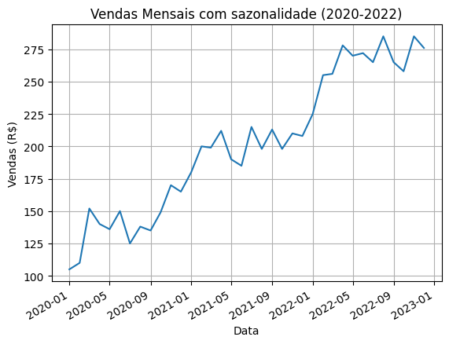
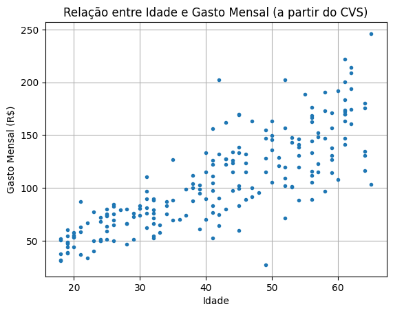

# Estudo de Caso 01: Simulação de Gastos e Séries Temporais

Este projeto consiste na geração de dados fictícios baseado em gráficos existentes para replicar uma análise de comportamento de consumo e performance de vendas ao longo do tempo.

### 📊 O que foi feito:
- **Relação Idade x Gasto:** Geração de dados usando `numpy.random` para simular uma correlação positiva entre a idade e o gasto mensal.
- **Sazonalidade de Vendas:** Criação de uma série temporal (2020-2022) para visualizar flutuações mensais de faturamento.
- **Manipulação de Datas:** Uso da biblioteca `mdates` para formatação precisa de eixos cronológicos.

### 🛠️ Tecnologias Utilizadas:
- Python
- Pandas & NumPy
- Matplotlib (Visualização de dados)

### 📈 Visualização:

