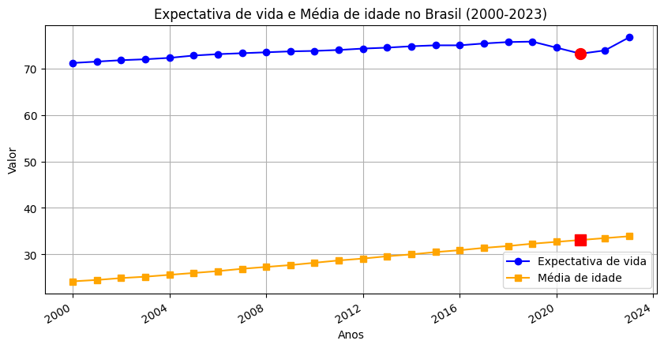

# Estudo de Caso 02: Análise Demográfica no Brasil (2000-2023)

Uma análise investigativa sobre a correlação entre a expectativa de vida ao nascer e a média de idade da população brasileira, com foco no impacto da pandemia de COVID-19.

### 🔍 Hipóteses Investigadas:
1. **Hipótese A:** O aumento da expectativa de vida gera um aumento direto na média de idade. (**Refutada**)
2. **Hipótese B:** Em 2021, ambos os indicadores sofreriam queda devido à pandemia. (**Parcialmente Refutada**)

### 🧪 Análise Estatística:
Para validar as hipóteses, foram aplicados:
- **Regressão Linear** (`np.polyfit`)
- **Coeficiente de Correlação (r):** 0.8412 (Indica correlação forte)
- **Coeficiente de Determinação (R²):** 0.7076

### 💡 Insight Principal:
A análise revelou que, apesar da forte correlação estatística, os indicadores são independentes em situações de crise. Em 2021, a **expectativa de vida caiu drasticamente**, enquanto a **média de idade continuou subindo**, mostrando que o envelhecimento populacional é um processo estrutural que não retrocedeu com a crise sanitária momentânea.

### 📈 Visualização do Impacto de 2021:

